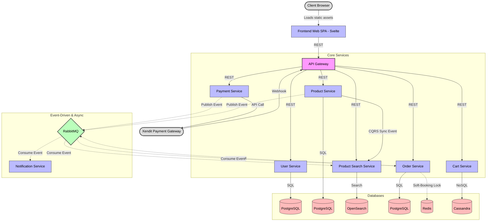

# Architecture Blueprint

**Project:** E-Commerce Microservices  
**Status:** In Design  
**Last Updated:** 2026-06-28

> **⚠️ Learning Project Disclaimer**
> This architecture deliberately applies patterns used at companies like Netflix, Shopify, and Amazon to a very small domain (a bookstore). The polyglot stack, full observability suite, and distributed data stores are **intentional overkill** — chosen to maximize engineering exposure to enterprise patterns, not to solve a business scaling problem.

---

## 1. Repository & Infrastructure Strategy

- **Strategy:** **Monorepo** — one GitHub repository for all services.
- **Orchestration:** **Docker & Docker Compose**. A single `docker-compose up` at the project root starts the entire ecosystem (applications, databases, message broker, search engine, observability).

### Monorepo Folder Structure

```text
ecommerce-app/
├── frontend-web/           # [TypeScript - Svelte/Vite] SPA User Interface
├── api-gateway/            # [Go] Entry point, BFF, Rate Limiter
├── user-service/           # [Node.js - NestJS] Identity & JWT issuance
├── product-service/        # [Go] Product catalog master (Source of Truth)
├── product-search-service/ # [Python - FastAPI] Search engine sync (OpenSearch)
├── cart-service/           # [Node.js - Express] Persistent cart (Cassandra)
├── order-service/          # [PHP - Laravel] Transaction core & soft-booking
├── payment-service/        # [Node.js - Express] Xendit webhook handler
├── notification-service/   # [Go/Python] Async email background worker
├── load-tests/             # k6 scripts for load, spike, and stress testing
├── docker/                 # Infrastructure configs (Prometheus, Loki, DB init)
└── docker-compose.yml      # Single orchestration file for the full ecosystem
```

---

## 2. Service Boundaries & Tech Stack

### Service Table

| Service | Role | Communication Style |
|---|---|---|
| **Frontend Web** | User Interface (SPA) | Calls API Gateway via HTTP |
| **API Gateway** | Single entry point, routing, JWT validation, rate limiting, API stitching (BFF) | Synchronous (REST) |
| **User Service** | Registration, login, profile management, JWT generation | Synchronous (REST) |
| **Product Service** | Book catalog CRUD, stock management (Source of Truth) | Synchronous (REST) |
| **Product Search Service** | OpenSearch indexing and full-text/faceted search | Synchronous (REST) + Async (Consumer) |
| **Cart Service** | Persistent shopping cart logic | Synchronous (REST) |
| **Order Service** | Checkout, order lifecycle, cron job for expiry | Synchronous (REST) + Async (Consumer) |
| **Payment Service** | Xendit invoice creation, webhook receiver | Synchronous (REST) + Async (Publisher) |
| **Notification Service** | Email delivery via SMTP | Async only (Consumer) |

### Technology Selection

| Component | Language / Framework | Primary Storage | Reason |
|---|---|---|---|
| **Frontend Web** | TypeScript (Svelte + Vite) | Browser Storage | Svelte compiles to highly optimized vanilla JS. No Virtual DOM means maximum performance and minimal bundle size. |
| **API Gateway** | Go (Fiber / Gin) | Redis | Extreme concurrency via goroutines; minimal latency and RAM usage at the network edge. |
| **User Service** | Node.js (NestJS) | PostgreSQL | Mature `bcrypt` and `jsonwebtoken` ecosystem; NestJS enforces strongly-typed, modular code for identity. |
| **Product Service** | Go (Gin) | PostgreSQL | Fast CRUD; PostgreSQL handles the Many-to-Many book-category relational model cleanly. |
| **Product Search Service** | Python (FastAPI) | OpenSearch | Python's text processing libraries pair naturally with OpenSearch's inverted index engine. |
| **Cart Service** | Node.js (Express) | Apache Cassandra | Write-heavy, high-availability store; Cassandra is purpose-built for this access pattern. |
| **Order Service** | PHP (Laravel) | PostgreSQL + Redis | Eloquent ORM simplifies complex business logic; built-in scheduler for cron jobs; ACID-compliant PostgreSQL for financial transactions. |
| **Payment Service** | Node.js (Express) | PostgreSQL | Third-party payment SDKs (Xendit, Stripe) are best supported in the JS/TS ecosystem. |
| **Notification Service** | Go / Python | — | Pure background consumer; both languages excel as lightweight, high-throughput queue workers. |
| **Observability** | Prometheus + Loki + Grafana | TSDB + Disk (chunks) | Industry-standard triad: Prometheus for metrics, Loki for log aggregation, Grafana for unified visualization. |

---

## 3. Data & Communication Strategy

### Rule: One Service, One Database

No service accesses another service's database directly. All cross-service data exchange happens through APIs or events.

### Golden Rules of Inter-Service Communication

**When to use Synchronous (HTTP REST)?**
Only for **read operations** where the result is immediately critical to the current request:
- *Valid:* During checkout, Order Service calls Product Service via HTTP GET to validate current stock and price. If Product Service is down, the checkout fails gracefully — this is intentional.

**When to use Asynchronous (RabbitMQ)?**
For all **write/status-change operations** that affect another service's data, or any operation that can be deferred:
- *Valid:* Payment Service publishes `OrderPaid` to RabbitMQ after webhook validation. It does not call Order Service directly — if Order Service is temporarily down, the message is safely queued.

| Pattern | Use Case |
|---|---|
| HTTP GET (Sync) | Checkout price/stock validation, login, data aggregation (BFF) |
| RabbitMQ Publish (Async) | Payment success, product sync, notification trigger, order expiry |

### Data Stores

| Store | Used By | Reason |
|---|---|---|
| **PostgreSQL** | User, Product, Order, Payment | ACID compliance for financial and relational data |
| **Apache Cassandra** | Cart | Write-heavy, always-available, distributed NoSQL |
| **Redis** | API Gateway (rate limit), Order (soft-booking) | Sub-millisecond in-memory counter and lock storage |
| **OpenSearch** | Product Search | Full-text search, typo-tolerance, faceted filtering |
| **RabbitMQ** | Order, Payment, Notification, Product Search | Durable async message broker |

---

## 4. Architecture Diagram



---

## 5. Development Roadmap

| Phase | Focus | Description |
|---|---|---|
| **Phase 1** | Infrastructure | Setup Monorepo, `docker-compose.yml` for all databases, brokers, and observability stack. |
| **Phase 2** | Identity & Gateway | Build User Service (Auth/Login) and API Gateway (routing, JWT validation, rate limiting). |
| **Phase 3** | Catalog & Search | Build Product Service with CRUD. Add OpenSearch container and CQRS sync pipeline. |
| **Phase 4** | Transactions | Build Cart Service and Order Service. Connect checkout to Product Service stock validation. |
| **Phase 5** | Payments & Events | Integrate Xendit webhooks. Wire RabbitMQ across Payment, Order, and Notification services. |
| **Phase 6** | Observability & Load Testing | Configure Prometheus + Loki + Grafana dashboards. Write and execute k6 test scenarios. |

---

## 6. Load Testing Strategy

Tool: **k6 (by Grafana)** — scripts located in `load-tests/`.

| Test Type | Virtual Users | Target | Goal |
|---|---|---|---|
| **Load Test** | 200 VU, constant | Login → Search → Checkout | Measure baseline latency and Gateway stability |
| **Spike Test** | 10 → 1000 VU in 5s | POST /checkout | Validate RabbitMQ buffering and soft-booking under flash-sale conditions |
| **Stress Test** | Unbounded escalation | Full user journey | Find the breaking point of each service |
| **Security Test** | 1000 VU, no bypass | POST /checkout | Confirm Rate Limiter blocks abuse before it reaches the database |

**Rate Limit Bypass for Load Tests:**
k6 runs from a single IP. Without a bypass, the rate limiter would block 99% of test traffic before it reaches internal services, making performance testing ineffective. Solution: k6 scripts inject a secret header (`X-Stress-Test-Bypass: <secret>`). The Gateway disables rate limiting for requests carrying this header. This header is **only valid in non-production environments**.

---

## 7. Advanced Patterns

| # | Pattern | Description |
|---|---|---|
| 1 | **Soft-Booking via Redis** | Order Service sets a Redis key with 15-minute TTL to reserve stock during payment window. If payment fails or times out, the key expires and stock is automatically released. |
| 2 | **Stateless JWT Validation** | API Gateway validates JWT signatures independently using a shared secret key. No HTTP call to User Service is needed per request, eliminating a critical bottleneck. |
| 3 | **Correlation ID (Distributed Tracing)** | API Gateway generates a `X-Correlation-ID` (UUID) for every inbound request and forwards it through all service calls. Enables end-to-end log tracing across services in Grafana Loki. |
| 4 | **Unified Observability (Prometheus + Loki + Grafana)** | All services expose `/metrics` for Prometheus scraping. All services emit JSON-structured logs consumed by Loki. Grafana provides a single pane of glass for metrics and logs. |
| 5 | **API Stitching / BFF (Backend for Frontend)** | API Gateway fetches data from multiple services and assembles the response, preventing the frontend from needing to make multiple round trips. Example: Order history page merges Order Service and Product Service responses. |
| 6 | **Hybrid Permission Model** | Coarse-grained role check at Gateway (blocks `/admin/*` for non-admin roles). Fine-grained ownership check inside each service (verifies `X-User-ID` matches the resource owner). |
| 7 | **Event-Carried State Transfer** | Events published to RabbitMQ carry all data consumers need. Consumers never need to call back to the publisher's service to retrieve additional data, ensuring full service independence. |
| 8 | **Header Injection (Internal Auth)** | Upon successful JWT validation, the Gateway strips the JWT and injects plain headers (`X-User-ID`, `X-User-Role`). Internal services trust these headers implicitly — they are unreachable from outside the private Docker network. |

---

## 8. Structured Logging Standard

All services — regardless of language — **must** emit logs as JSON to stdout. Grafana Loki will parse each key as a searchable label.

**Required JSON Fields:**

```json
{
  "timestamp": "2026-06-28T10:00:00Z",
  "level": "info",
  "service_name": "order-service",
  "correlation_id": "a1b2-c3d4-e5f6",
  "message": "Order created successfully",
  "metadata": {}
}
```

**Banned log format:** Plain text strings (e.g., `[INFO] Order 123 created`). These cannot be filtered in Loki.
