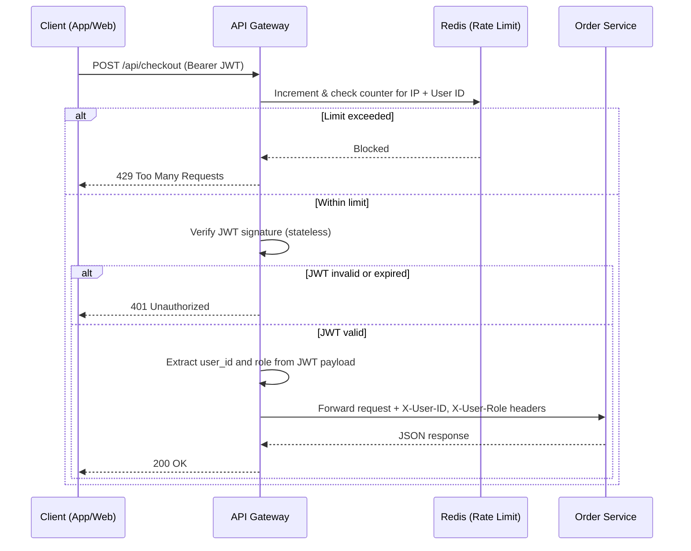
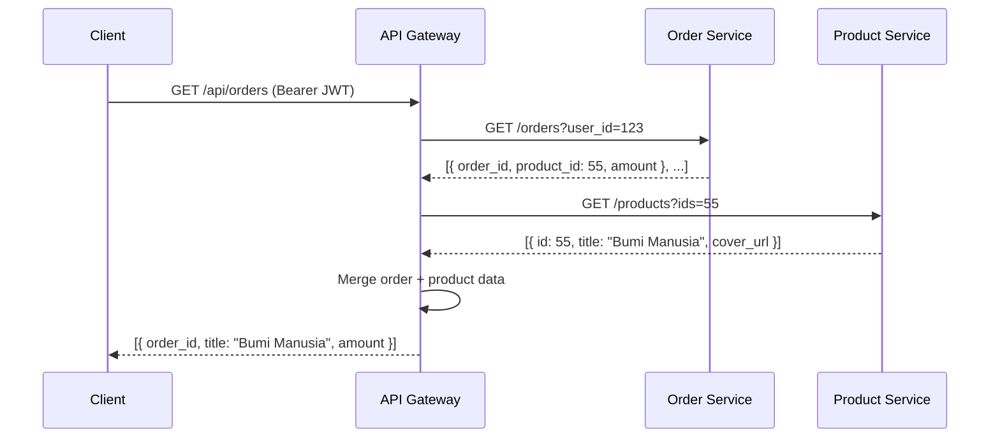

# API Gateway — Service Documentation

**Language:** Go (Fiber / Gin)  
**Stores:** Redis (rate limit counters)  
**Internal Port:** `8000` (only service with a public-facing port)  
**Owned by:** Infrastructure Team

> For cross-service communication rules and the full system diagram, see [blueprint.md](../blueprint.md).

---

## Responsibilities

| # | Responsibility | Detail |
|---|---|---|
| 1 | **Routing** | Forwards public requests to the correct internal service container |
| 2 | **Stateless JWT Validation** | Verifies JWT signature using shared secret key — no call to User Service required |
| 3 | **Header Injection** | Strips JWT, injects `X-User-ID` and `X-User-Role` headers for internal services |
| 4 | **Coarse-Grained Authorization** | Blocks `/api/admin/*` routes if JWT role is not `admin` |
| 5 | **Rate Limiting — IP** | Max 100 req/min per IP address (DDoS / bot protection) |
| 6 | **Rate Limiting — User ID** | Max 1 req/10s per user on transactional endpoints (double-click prevention) |
| 7 | **API Stitching (BFF)** | Fetches data from multiple services and merges into a single response |
| 8 | **Load Test Bypass** | Disables rate limiting if request contains `X-Stress-Test-Bypass` secret header (dev/staging only) |

---

## Routing Table

| Public URL | Forwards To | Auth Required |
|---|---|---|
| `POST /api/auth/login` | User Service | ❌ No |
| `POST /api/auth/register` | User Service | ❌ No |
| `GET /api/products` | Product Service | ❌ No |
| `GET /api/search` | Product Search Service | ❌ No |
| `GET /api/cart` | Cart Service | ✅ Yes |
| `POST /api/cart` | Cart Service | ✅ Yes |
| `POST /api/checkout` | Order Service | ✅ Yes (rate limited: 1/10s) |
| `GET /api/orders` | Gateway BFF (stitches Order + Product) | ✅ Yes |
| `POST /api/admin/*` | Various (Admin role only) | ✅ Yes + Admin |

---

## Flow: Protected Endpoint (e.g., Checkout)

---

## Flow: API Stitching — Order History Page

---

## Environment Variables

| Variable | Example | Description |
|---|---|---|
| `JWT_SECRET` | `supersecret` | Shared key for JWT signature validation |
| `REDIS_URL` | `redis:6379` | Redis connection for rate limit counters |
| `USER_SERVICE_URL` | `http://user-service:3001` | Internal routing target |
| `ORDER_SERVICE_URL` | `http://order-service:3005` | Internal routing target |
| `STRESS_TEST_BYPASS_KEY` | `k6-bypass-secret` | Secret for disabling rate limit during load tests |
