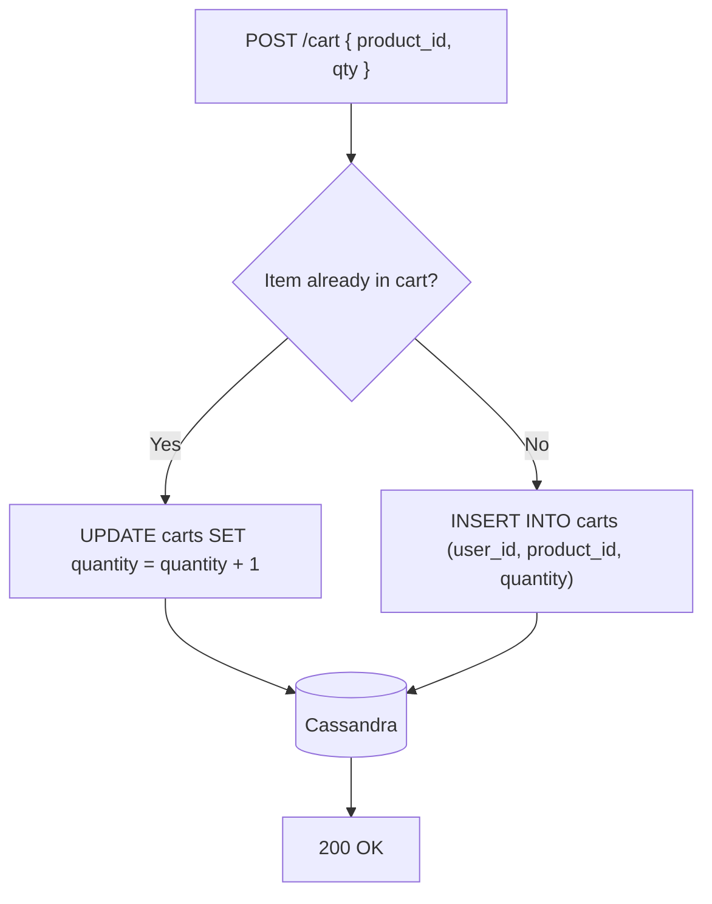

# Cart Service — Service Documentation

**Language:** Node.js (Express)  
**Store:** Apache Cassandra  
**Internal Port:** `3004`  
**Owned by:** Commerce Team

> For cross-service communication rules and the full system diagram, see [blueprint.md](../blueprint.md).

---

## Responsibilities

Manages the user's shopping cart with a **persistent, device-agnostic** guarantee. Cart data survives session expiry and device switches.

- Add, update, and remove cart items
- Retrieve the full cart for a user
- Clear the cart after a successful checkout (called by Order Service)

---

## Endpoints

| Method | Path | Auth | Description |
|---|---|---|---|
| `GET` | `/cart` | ✅ `X-User-ID` | Retrieve all items in the user's cart |
| `POST` | `/cart` | ✅ `X-User-ID` | Add item or increment quantity |
| `DELETE` | `/cart/:item_id` | ✅ `X-User-ID` | Remove a specific item |
| `DELETE` | `/cart` | ✅ `X-User-ID` | Clear entire cart (used post-checkout) |

---

## Why Cassandra?

Adding items to a cart is the **highest-frequency write operation** in e-commerce — far more common than actual purchases. Cassandra is purpose-built for write-heavy, always-available workloads. Its distributed model also enables the "eternal cart" feature naturally.

> ⚠️ **Learning Note:** For a small bookstore, Redis or even PostgreSQL would handle cart storage perfectly fine. Cassandra here is intentional overkill for learning purposes.

---

## Data Model

```sql
-- Cassandra CQL (NoSQL — no JOINs)
CREATE TABLE carts (
  user_id    UUID,
  product_id INT,
  quantity   INT,
  added_at   TIMESTAMP,
  PRIMARY KEY (user_id, product_id)
);
```

Using `(user_id, product_id)` as composite primary key allows:
- Fast retrieval of all items for a user: `SELECT * FROM carts WHERE user_id = ?`
- Upsert behavior: adding an existing item updates quantity automatically

---

## Flow: Add Item to Cart



---

## Environment Variables

| Variable | Example | Description |
|---|---|---|
| `CASSANDRA_HOSTS` | `cassandra` | Cassandra contact points |
| `CASSANDRA_KEYSPACE` | `ecommerce` | Keyspace name |
| `PORT` | `3004` | Internal service port |
